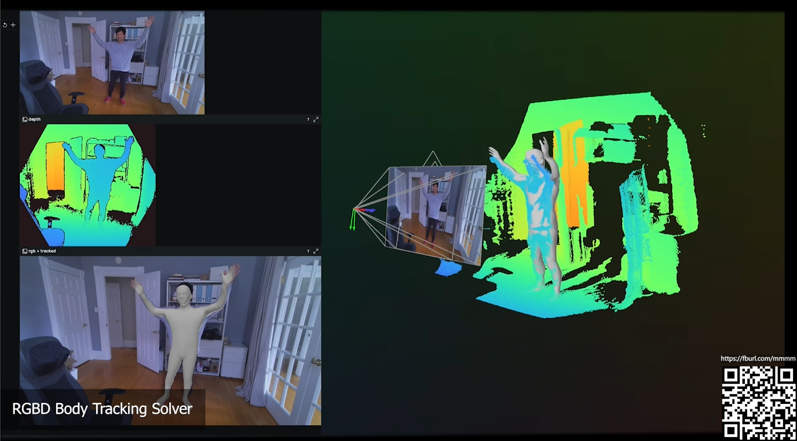
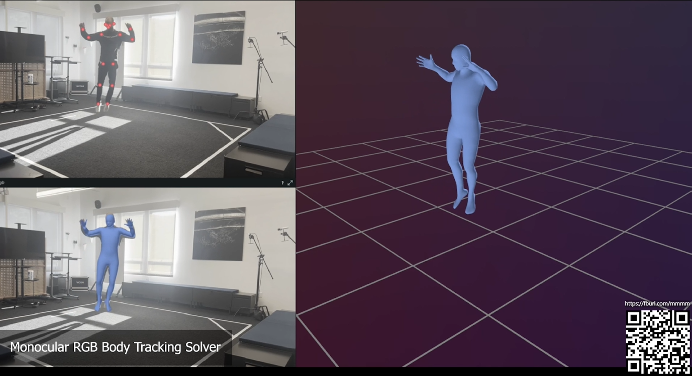

# Momentum

Momentum provides foundational algorithms for human kinematic motion and
numerical optimization solvers to apply human motion in various applications.

<p align="center">
  
  
  
</p>

## Getting Started

This page guides you through the process of building Momentum and running the examples.

### Prerequisite

Complete the following steps only once:

1. Install Pixi by following the instructions on https://prefix.dev/

1. Clone the repository and navigate to the root directory:

   ```
   git clone https://github.com/facebookincubator/momentum
   cd momentum
   ```

   Ensure that all subsequent commands are executed in the project's root directory unless specified otherwise.

### Build Momentum

After completing the prerequisites, you are ready to build and use Momentum.

- Build the project with the following command (note that the first run may take a few minutes as it installs all dependencies):

  ```
  pixi run build
  ```

- Run the tests with:

  ```
  pixi run test
  ```

To view all available command lines, run `pixi task list`.

### Running Hello World

To run the `hello_world` example:

```
pixi run hello_world
```

Alternatively, you can directly run the executable:

```
# Linux and macOS
./build/hello_world

# Windows
./build/Release/hello_world.exe
```

### Running Example

To run other examples:

```
pixi run glb-viewer --help
```

For more examples, please refer to the [Examples](https://facebookincubator.github.io/momentum/docs/examples/viewers) page.

### Clean Up

If you need to start over for any reason:

```
pixi run clean
```

Momentum uses the `build/` directory for CMake builds, `.pixi/` for the Pixi virtual environment, and `.deps/` for building dependencies. You can clean up everything by either manually removing these directories or by running the command above.

## 📖 Documentation

The full documentation for Momentum can be found on our [website][docs].

[docs]: https://facebookincubator.github.io/momentum

## Contributing

Check our [contributing guide](CONTRIBUTING.md) to learn about how to contribute
to the project.

## License

Momentum is licensed under the MIT License. A copy of the license
[can be found here.](LICENSE)
